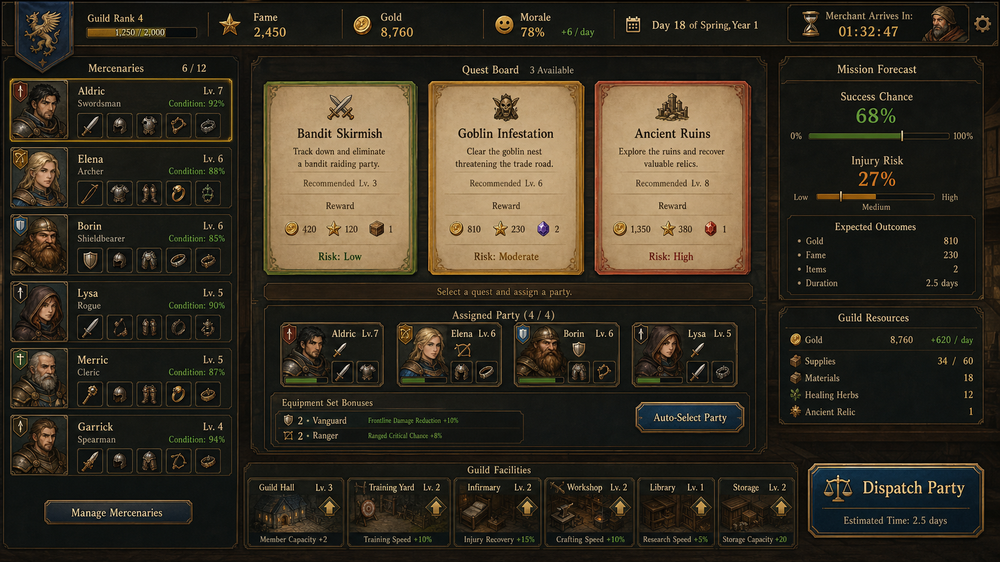
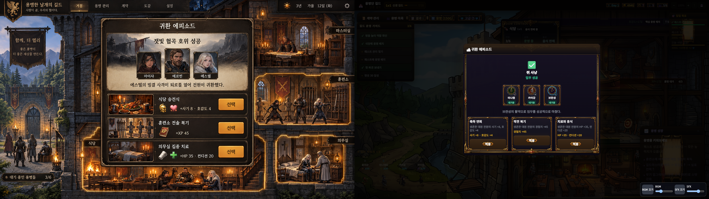

# GuildManager 게임 기획서(GDD)

- 문서 유형: 게임 디자인 문서(Game Design Document)
- 문서 버전: 2.0
- 프로젝트(코드) 버전: 1.6.0 [사실: package.json `version: "1.6.0"`]
- 작성일: 2026-09-11 (KST)
- 근거 범례: **[사실]** = 소스 코드·테스트·package.json·현재 커밋 시점 문서에서 직접 확인. **[계획]** = 설계 문서·체크리스트·`next_improvement_instruction.md`에 존재하지만 실행 코드로 확인되지 않음. **[제안]** = 본 개정에서 새로 제시하는 권고(근거 없음, 검증 필요).



---

## 0. 근거 노트 (요약)

- 본 문서는 `src/App.tsx`, `src/types.ts`, `src/data/{mercenaries,equipment,dungeons,buildings,quests,passives,weapons}.ts`, `src/utils/{roomAgents,roomProgression,returnEpisode,tacticalReplay,onboardingAdvisor}.ts`, `src/hooks/{useSaveLoad,useDungeon,useGameLoop,useMerchant}.ts`, `tests/*.test.mjs` 5종을 직접 열람해 작성했다.
- `docs/GuildManager_기획서.md`는 2026-09-11 v1.6.0 귀환 에피소드 항목까지 별도 존재하며, 본 GDD의 귀환 에피소드 서술은 해당 문서와 코드가 일치함을 대조 확인한 뒤 재구성했다. 단, 해당 파일의 앞부분(약 1~366행)은 저장 인코딩이 손상되어 한글이 깨져 있어(`grep "박수진"` 무매치) 그 구간의 페르소나·레퍼런스 표는 본 문서에 그대로 인용하지 않았다. 대신 인코딩이 정상인 `docs/persona_playtest_feedback.md`(2026-07-01 최신화)의 페르소나를 채택했다.
- `npm test` 실행 결과: **22개 테스트 전부 통과 (roomAgents 3 + onboardingAdvisor 4 + tacticalReplayInsights 2 + uiFrameContract 6 + returnEpisode 7 = 22, fail 0)** [사실, 2026-09-11 재실행 확인].
- "20초 스모크 테스트"가 별도의 승인 게이트로 존재한다는 근거는 찾지 못했다 [미확인]. `docs/superpowers/plans/2026-05-06-equipment-merchant-dungeon.md`에 일반적인 "Smoke test checklist"(브라우저에서 릴리스 HTML을 열어 확인하는 체크리스트)는 존재하지만, 시간(초) 기준은 명시되어 있지 않다. 따라서 본 문서는 "20초 스모크"를 확정 사실로 기재하지 않는다.
- [사실] v1.6.0 portable 20.7초 생존·실제 창 1·내장 HTTP index/JS/CSS 200·root/release/Drive SHA 일치

---

## 1. 문제 정의

**어떤 사람이:** 퇴근 후 또는 주말에 10~30분 단위로 짧게 접속해 조직(길드)을 운영하는 경영 시뮬레이션 애호가.
**어떤 상황에서:** 계약을 완료했지만 결과가 로그 한 줄과 골드·명성 보상으로 끝나, 어떤 용병이 왜 그런 결과를 얻었는지, 그 결과가 다음 파견 전략에 어떻게 이어지는지를 체감하지 못한다.
**왜 필요한가:** 파견 → 결과 확인 → 회복/성장 선택 → 재파견이라는 짧은 순환을 유지하면서도, 각 순환마다 "이번엔 무슨 일이 있었는가"를 이름 있는 서사로 남겨야 이탈을 줄일 수 있다.

이 문제 인식은 `docs/persona_playtest_feedback.md`의 실제 플레이테스트 피드백(아래 2장)에서 도출되었다 [사실].

---

## 2. 주 페르소나

**이름:** 박시현, 31세 [사실: `docs/persona_playtest_feedback.md`]
**선호 장르:** 길드 경영 시뮬레이션
**플레이 성향:** Football Manager와 방치형(idle) 경영 게임을 함께 즐기는 조직 운영형 플레이어. 길드원 배치와 임무 결과가 누적되어 조직이 자라는 감각을 기대한다.
**실제 피드백(2026-07-01 최신화):**
- 좋았던 점: 길드원 성향과 임무 결과가 누적되어 조직이 자라는 감각.
- 헷갈린 점: 상태 변화가 많아질수록 어떤 규칙이 핵심인지 모호해진다.
- 이탈 가능 지점: 길드 운영 상태 변화가 복잡해질수록 핵심 규칙을 고정할 필요가 있다.
- 1순위 개선 제안: 임무 결과 화면에 성장·피로·자원·다음 배치 리스크를 4개 슬롯으로 고정한다.

박시현에게 v1.6.0 귀환 에피소드는 "누가 왜 이렇게 됐는지"를 이름으로 서술해 그가 원했던 "누적되어 자라는 감각"을 직접 겨냥한 기능이다.

---

## 3. Core Loop (핵심 루프) (X→Y→X)

```
[대기 중인 길드 상태] → 용병을 계약(퀘스트)에 배정한다 → [진행 중 계약] →
완료 시점에 귀환 에피소드로 결과·원인을 확인하고 3가지 활동 중 하나를 고른다 →
[성장/회복된 길드 상태, 변경된 자원] → 다시 용병을 계약에 배정한다 → [대기 중인 길드 상태]
```

핵심은 X(대기 상태)에서 시작해 판단(배정)과 결과(귀환 에피소드)를 거쳐 다시 X(대기 상태, 단 자원·용병 스탯이 갱신됨)로 돌아오는 순환이다. 이 순환에 v1.6.0에서 "귀환 후 되돌아보기" 서브 루프가 추가되었다:

```
계약 파견 완료 → 참가자별 귀환 원인·상태 확인 → 3가지 활동(연회/복기/치료) 중 하나 선택
  → 용병·룸 피드백 확인 → 다시 파견
```
[사실: `src/utils/returnEpisode.ts`, `docs/GuildManager_기획서.md` 2026-09-11 항목과 코드 대조 확인]

---

## 4. MVP 가설

1. **[귀환 에피소드]가 있으면** 파견 완료 시점의 "왜 이렇게 됐는가"가 이름 있는 서사로 제공되어, 결과 확인 후 재파견까지의 체감 마찰이 줄어든다. 검증: 귀환 에피소드 선택 완료율, 선택 소요 시간(중앙값).
2. **[퀘스트 위험도 사전 안내]가 있으면** 배정 전에 사망 위험·컨디션 소모 예측을 확인할 수 있어 파견 실패로 인한 이탈이 줄어든다. 검증: 실패 후 재도전 전환율.
3. **[룸 시설 진행도]가 있으면** 시설 업그레이드 목표가 명확해 자원 소비 방향이 뚜렷해진다. 검증: 시설 완료율.
4. **[온보딩 어드바이저]가 있으면** 신규 플레이어가 첫 계약까지 이르는 경로가 짧아진다. 검증: 첫 계약 진입까지의 행동 수.

이 가설들은 코드에 이미 구현된 기능(귀환 에피소드, 룸 시설, 온보딩 어드바이저)에 대해 사후적으로 검증 방법을 정의한 것이며, 실측 데이터는 아직 없다 [계획: 측정 로그 파이프라인 미구현].

---

## 5. 레퍼런스 분석 — 교훈 각색 (차용이 아님)



v1.6.0 귀환 에피소드는 아래 두 게임의 구조를 그대로 옮기지 않고, 우리 게임의 "귀환 후 되돌아보기" 공백에 맞게 교훈만 각색했다 [사실: `docs/GuildManager_기획서.md` 2026-09-11 항목].

| 레퍼런스 게임 | 핵심 흐름 (행동 단계 수) | 우리가 얻은 교훈 (각색, 복사 아님) |
|---|---|---|
| **Bistro Heroes(이세계 용사 식당)** 계열 | 결과 확인 → 식사 선택 → 캐릭터 회복/호감도 즉시 피드백 (**3단계**) | 휴식·식사라는 소재를 캐릭터 중심의 "마무리 비트"로 바꾸면 결과가 감정으로 남는다. → 이를 "축하 연회"(사기+호감도) 선택지로 각색했다. |
| **Hustle Castle** | 룸 선택 → 거주민 배치 → 생산/훈련 피드백 (**3단계**) | 룸 배치·상태 변화는 수치 로그가 아니라 성(城) 안에서 눈으로 보이게 만들어야 한다. → 기존 `roomAgents`의 룸 슬롯 텍스트·`focusRoom` 장면 포커스를 재사용해 활동 선택이 실제 룸에서 일어나는 것처럼 보이게 각색했다. |

새 통화나 새 룸 시스템은 만들지 않았다. 이미 있는 방(길드마스터룸/훈련소/식당) 개념과 `roomAgents`를 재사용했다는 점이 "차용이 아닌 각색"의 근거다 [사실].

---

## 6. 성공 KPI (수치 KPI)

핵심 루프 전반의 KPI (기존, `docs/GuildManager_기획서.md` 성공 KPI 표. 숫자는 ASCII/퍼센트 기호로 원문 손상 구간에서도 그대로 보존되어 대조 확인됨):

| 지표 | 목표 수치 | 측정 방법 |
|---|---|---|
| 첫 세션 평균 플레이 시간 | 8분 이상 | 첫 실행 ~ 브라우저 탭 종료 기준 |
| 첫 세션 내 2라운드 진입률 | 55% 이상 | 결과 화면에서 재시도 버튼 클릭 |
| 핵심 선택 화면 이탈률 | 15% 이하 | 퀘스트 배정 화면 진입 후 무응답 종료 |
| D1 리텐션 | 30% 이상 | 첫 플레이 다음날 재접속 |
| 세션당 완료 퀘스트 수 | 평균 3건 이상 | 세션 내 퀘스트 완료 확정 횟수 |
| 장비 세트 완성 전달률 | 20% 이상 | 2세트 효과 이상 성공 기록 |

v1.6.0 귀환 에피소드 전용 KPI [사실: `docs/GuildManager_기획서.md` 2026-09-11 항목]:

| 지표 | 목표 수치 |
|---|---|
| 귀환 에피소드 선택 완료율 | 70% 이상 |
| 선택 소요 시간(중앙값) | 8초 이내 |
| 재파견까지 2분 이내 도달률 | 기존 대비 +10%p |
| 중복 보상 발생 건수 | 0건 |
| 1600x900 기준 모달 겹침 결함 | 0건 |

모든 목표 수치는 아직 실측 로그가 없는 설계 목표이며 [계획], 달성 여부는 별도 계측 파이프라인 구축 후 확인해야 한다.

---

## 7. 디자인 필러 (디자인 기둥)

1. **자원 배분의 재미** — 용병·자금·시간(계약 소요일)을 배분하는 관리형 의사결정.
2. **리스크-보상 긴장감** — 계약 실패 시 컨디션·사기 손실, 최악의 경우 부상/영혼(사망) 처리가 존재해 파견 배정에 무게가 실린다 [사실: `useGameLoop.ts`의 성공/실패 분기].
3. **장기 육성 성취감** — 레벨·장비·패시브·룸 시설이 누적되는 성장 축.
4. **귀환 서사(v1.6.0 신규)** — 결과가 숫자가 아니라 "누가 왜 이렇게 됐는지"로 남는 인정(recognition)의 순간.

기획의 핵심 메시지 [사실: `docs/GuildManager_기획서.md`]: "GuildManager는 '수치를 쌓는 게임'이라기보다 '매 세션 최적 결과 조합을 찾아가는 게임'이다."

---

## 8. 구성요소(Systems) 표

| 구성요소 | 역할 | 플레이어 선택 | 입력 → 판단 → 피드백 | 구현 상태 |
|---|---|---|---|---|
| 계약(퀘스트) 배정 | 용병을 파견해 보상·경험치를 얻는 핵심 루프 진입점 | 어떤 계약에 어떤 용병 조합을 배정할지 | 퀘스트 목록 확인 → 위험도/보상 비교 → 배정 후 타이머 진행 결과 로그 | **구현됨** [사실: `useGameLoop.ts`, `src/data/quests.ts`] |
| 던전 원정 | 층 단위로 진행하며 층마다 골드·경험치, 5층 이상부터 장비 드랍 | 몇 층까지 도전할지, 실패 시 포기할지 | 층 클리어 시도 → 사망 위험/보상 판단 → 층별 보상 즉시 지급 | **구현됨** [사실: `useDungeon.ts`] |
| 상인/장비 구매 | 20분 간격으로 등장하는 상인에게서 장비 구매 | 예산 대비 어떤 등급/부위 장비를 살지 | 상인 재고 확인 → 가격(원가×1.2) 대비 효과 판단 → 즉시 구매 반영 | **구현됨** [사실: `useMerchant.ts`] |
| 룸 시설 업그레이드 | 길드마스터룸/훈련소/식당 각 3단계 시설 업그레이드로 룸 티어 상승 | 어떤 룸의 어떤 시설을 먼저 올릴지 | 시설 비용 확인 → 자원 보유량 판단 → 완료 시 룸 티어 게이트 해제 | **구현됨** [사실: `src/utils/roomProgression.ts`] |
| 귀환 에피소드 | 계약 완료 후 참가자별 원인 서술과 3가지 활동 선택 | 축하 연회/작전 복기/치료와 휴식 중 하나 | 원인 서술 확인 → 어떤 회복·성장 축이 필요한지 판단 → 스탯 변화 배지 즉시 표시 | **구현됨** [사실: `src/utils/returnEpisode.ts`, `tests/returnEpisode.test.mjs`] |
| 전술 리플레이 | 진행 중 계약의 전력비·함정 대응·보상을 인사이트 카드로 제공 | 리플레이를 열람하고 조합을 재고할지 | 전력비/함정 대응 확인 → 경고 톤 여부 판단 → 다음 배정에 반영 | **구현됨** [사실: `src/utils/tacticalReplay.ts`, `tests/tacticalReplayInsights.test.mjs`] |
| 온보딩 어드바이저 | 신규 플레이어에게 다음 행동을 순차 안내 | 안내를 따를지 무시할지(강제 아님) | 현재 진행 상태 확인 → 어떤 액션이 비어있는지 판단 → 강조 버튼/힌트로 안내 | **구현됨** [사실: `src/utils/onboardingAdvisor.ts`, `tests/onboardingAdvisor.test.mjs`] |
| 세이브/로드 | 슬롯 기반 저장, 레거시 데이터 정규화 | 어느 슬롯에 저장/불러올지 | 슬롯 선택 → 데이터 유효성 판단(정규화) → 로드 완료 반영 | **구현됨** [사실: `src/hooks/useSaveLoad.ts`] |
| 접근성 옵션(색맹 모드 등) | — | — | — | **미구현** [사실: 코드 전역 검색 결과 색맹모드·키 리매핑·텍스트 크기 옵션 없음] |

---

## 9. 콘텐츠 제공 방식 (실제 콘텐츠 카운트, 코드 확인)

> 아래 수치는 모두 `src/data/*.ts` 코드에서 직접 확인한 값이며, 추정치는 포함하지 않는다.

**용병 (`src/data/mercenaries.ts`)**
- 초기 용병 3명(D등급 2, C등급 1). 이후 용병은 `generateMercenary`로 절차적 생성.
- 등급 5단계: D·C·B·A·S. 등급별 전투력 총합(`GRADE_STAT_TOTALS`): D 42 / C 58 / B 72 / A 86 / S 102.
- 등급별 사망 비용(`DEATH_COSTS`): D 80 / C 150 / B 280 / A 500 / S 1000.
- 레벨 상한 50, 경험치 요구치 = `level × 100`.
- 등급 출현 확률은 여관(tavern) 레벨 0~4에 따른 가중치 테이블로 결정된다.

**계약/퀘스트 (`src/data/quests.ts`)**
- 총 19종. 난이도 18~700, 골드 보상 상한 1,400G, 명성 보상 1~125, 경험치 보상 7~330, 소요일 1~8일, 사망 위험 0~35%. 슬롯은 전부 4(필요 최소 인원 1~4명).
- 선행 퀘스트 게이트(`requiredQuestId`) 5개가 3개의 체인을 구성한다: 암흑 계열(q2 야간 경비 → q13 독숲 정찰 → q8 던전 탐사), 얼음 계열(q12 얼음 동굴 수색 → q15 설원 요새 탈환 → q18 빙원 극지 원정), 자연/상인 계열(q3 상인 호위 → q6 밀수단 추적).

**장비 (`src/data/equipment.ts`)**
- 4부위(무기·머리·몸통·장신구) × 부위별 5개 그룹 × 5등급 = **100종**.
- 세트 4종(철벽·그림자·현자·자연), 각 2세트/3세트 효과 보유.
- 구매가 40G(최저 등급 장신구)~920G(최고 등급 방어구). 상인 재고 3~5개. 퀘스트 티어(1~5)별 드랍 확률 8~40%.

**던전 (`src/data/dungeons.ts`)**
- 던전 이름 12종, 원소 5종. 티어(1~5)별 발동 확률 3~30%, 층 범위 1~10층.
- 골드/층 = 층수×80, 경험치/층 = 층수×25, 클리어 보너스 골드 = 최대층×200, 보너스 명성 = 최대층×5.

**건물/룸 (`src/data/buildings.ts`, `roomProgression.ts`)**
- 건물 5종(길드홀·병영·훈련소·여관·의무실), 각 최대 레벨 4.
- 방(룸) 3종(길드마스터룸·훈련소·식당), 방마다 시설 3개, 시설당 최대 레벨 3. 모든 시설이 목표 레벨에 도달해야 방 티어 업그레이드 가능.

**무기 (`src/data/weapons.ts`)**
- 5개 직업 × 3티어 = **15종**.

**패시브 (`src/data/passives.ts`)**
- 패시브 16종, 시너지 조합 8종. 용병 등급별 패시브 슬롯 수: D 1 / C 2 / B 3 / A 4 / S 5.

**성장/보상 공급 요약**
| 항목 | 수치 |
|---|---|
| 계약 최대 골드 보상 | 1,400G |
| 계약 사망 위험 범위 | 0~35% |
| 던전 클리어 보너스 골드 | 최대층 × 200 |
| 등급별 용병 사망 비용 | 80~1000 (D~S) |
| 장비 종류 | 100종 (4부위×5그룹×5등급) |
| 룸 시설 최대 레벨 | 3 (방당 시설 3개) |

**콘텐츠 제공 방식 요약 (계약/방/용병/성장/보상 공급/언락/변주)**
- 계약 공급: 위 19종 퀘스트가 상시 목록으로 제공되며, 난이도·소요일·사망 위험이 퀘스트별로 분산되어 있다 [사실].
- 방(룸) 공급: 길드마스터룸/훈련소/식당 3개 방, 방마다 시설 3개가 병렬로 열려 있어 자원을 어디에 먼저 투입할지 선택하게 한다 [사실].
- 용병 공급: 초기 용병 3명 이후에는 `generateMercenary`로 절차적 생성되어 등급(D~S) 가중치에 따라 매번 다른 조합이 공급된다 [사실].
- 성장 공급: 레벨(최대 50)·장비·패시브·룸 시설이 서로 다른 속도로 누적되는 다축 성장 구조다 [사실].
- 보상 공급: 계약 골드·명성·경험치, 던전 층별 보상, 상인 장비 판매가 각각 다른 주기(즉시/20분/층 클리어)로 공급된다 [사실].
- 언락(Unlock): 선행 퀘스트 게이트(`requiredQuestId`) 5개가 암흑/얼음/자연 3개 체인을 구성해 상위 계약을 순차적으로 언락하고, 방 시설은 모든 시설이 목표 레벨에 도달해야 방 티어가 언락된다 [사실].
- 변주(Variation): 절차적 용병 생성, 던전 원소 5종·티어별 발동 확률, 상인 재고 순환(20분 등장/10분 퇴장)이 매 세션 다른 조합을 만들어 반복 피로를 줄인다 [사실 기반 제안].

---

## 10. 세션 구조 — 4개 지평

**30초** — 게임 진입 직후: 온보딩 어드바이저가 `open-first-contract`(첫 계약 열기) 액션을 강조 표시한다. 튜토리얼이 활성화되어 있으면 우선 `INTRO_STEPS` 슬라이드가 노출된다 [사실: `src/utils/onboardingAdvisor.ts`, `App.tsx` `showTutorial`].

**5분** — 첫 계약 배정 → 완료 → 귀환 에피소드에서 3가지 활동(연회/복기/치료) 중 하나를 고르고 즉시 스탯 변화를 확인한 뒤 다음 계약을 배정한다. 온보딩 어드바이저는 이 구간에서 `recommend-party` → `launch-first-dispatch` → `watch-first-dispatch`로 액션을 전환한다.

**30분** — 여러 계약을 반복 배정하며 룸 시설(길드마스터룸/훈련소/식당) 업그레이드 자원을 모으고, 상인이 20분 간격으로 등장할 때 장비를 구매하며, 5층 이상 던전에 진입해 장비 드랍을 노린다.

**장기(수 세션 이상)** — 체인 퀘스트(암흑/얼음/자연 계열)를 순차 해금하고, 장비 세트 2/3종 효과를 노리며, 용병을 S등급까지 육성한다.

---

## 11. 재미 사슬 (재미가 만들어지는 지점, Fun Chain)

| 플레이어 행동 | 즉시 피드백 | 다음 행동으로의 연결 고리 |
|---|---|---|
| 계약에 용병 배정 | 전술 리플레이 인사이트(전력비, 함정 대응, 보상)로 성공/경고 톤 즉시 표시 | "이 조합이면 될까"를 재확인하고 배정을 조정 |
| 계약 완료 | 귀환 에피소드가 이름 있는 원인 서술("○○의 활약으로 성공")로 등장 | "누가 왜 이렇게 됐는지"를 확인하고 다음 활동을 고민 |
| 축하 연회 선택 | 사기 +8·호감도 +4가 즉시 반영, 식당 룸 장면이 포커스됨 | 팀 컨디션을 유지한 채 바로 재파견 |
| 작전 복기 선택 | 경험치 +45, 임계치 도달 시 레벨업(전투력·함정해제·스탯 동반 상승) | 다음 계약에서 더 강해진 조합을 시도 |
| 치료와 휴식 선택 | HP +35, 컨디션 +20, 부상 상태였던 용병은 대기중으로 복귀 | 부상 용병을 다시 파견 가능한 상태로 회복 |
| 룸 시설 업그레이드 완료 | 방 티어 게이트 해제 | 다음 시설/방 티어 목표가 새로 제시됨 |

이 표는 "이번 귀환은 어떻게 마무리할까"라는 짧은 기대감이 결과 확인 → 선택 → 다음 파견으로 이어지는 재진입 동기가 된다는 설계 의도를 반영한다 [사실: `docs/GuildManager_기획서.md` 2026-09-11 항목].

---

## 12. 실제 플레이 예시

**예시 1 — 성공: "고블린 소탕" (참가자: 카이강, 미나원)** [사실: `docs/GuildManager_기획서.md`, `tests/returnEpisode.test.mjs` 수치와 일치]
- 원인 서술: "카이강의 활약으로 임무를 성공적으로 마쳤다."
- 축하 연회 선택 시: 카이강·미나원 모두 사기 +8, 호감도 +4 (최대 100 클램프).
- 작전 복기 선택 시: 카이강·미나원 모두 경험치 +45(임계치 도달 시 레벨업).
- 치료와 휴식 선택 시: 카이강·미나원 모두 HP +35, 컨디션 +20.

**예시 2 — 실패: "심연 균열 조사" (참가자: 카이강, 미나원[부상], 고인[영혼])**
- 원인 서술: "미나원의 부상으로 임무는 실패로 끝났다."
- 축하 연회 선택 시: 카이강·미나원만 사기 +8, 호감도 +4 (고인은 완전히 제외).
- 치료와 휴식 선택 시: 카이강 HP +35/컨디션 +20, 미나원은 추가로 부상 → 대기중 전환. 고인(영혼 상태)은 어떤 선택지를 골라도 효과가 적용되지 않는다.

이 두 예시는 `applyFeast`/`applyReview`/`applyCare` 함수와 `tests/returnEpisode.test.mjs`의 단정문(예: `assert.equal(result.mercs[0].morale, 100)`, `assert.equal(healed.hp, 100)`)으로 뒷받침된다 [사실].

---

## 13. 실패/피로 완화 장치

- **한 번에 하나씩 노출**: `returnEpisodeState.pending[0]`만 화면에 표시되어 에피소드가 몰려서 뜨지 않는다 [사실].
- **모달 우선순위**: 결과 로그 모달 등 다른 모달이 열려 있으면 귀환 에피소드 모달은 뜨지 않아 화면 겹침이 없다(`returnEpisodeBlockingUIOpen`) [사실].
- **사망 참가자 완전 제외**: 상태가 '영혼'인 용병은 어떤 선택지를 골라도 효과·피드백 대상에서 제외되어 헛된 선택을 방지한다 [사실].
- **중복 처리 방지**: `resolvingReturnEpisodeIdsRef`가 처리 중인 에피소드 ID를 잠그고, `processedIds` 원장(최대 200건)이 이미 처리된 ID의 재적용을 막아 이중 보상을 방지한다 [사실].
- **결정론적 레벨업**: 작전 복기의 경험치 +45는 고정값이며 임의 확률 보정이 없어, 반복 파견 피로 없이 예측 가능한 성장 곡선을 제공한다 [사실].
- **퀘스트 위험 사전 안내**: 배정 전 실패 위험·컨디션 소모 요약을 제공해(`src/utils/questAdvisory.ts` [사실: 파일 존재]) 무리한 배정을 줄인다.

---

## 14. 경제/밸런스 레버

| 레버 | 값/공식 | 근거 |
|---|---|---|
| 건물 업그레이드 비용 | `기본비용 × 2^현재레벨` | [사실: `src/data/buildings.ts`] |
| 룸 시설 업그레이드 비용 | `기본비용 × (레벨+1) × 목표레벨` | [사실: `src/utils/roomProgression.ts`] |
| 계약 성공 시 사기/호감도 | +5 / +5 | [사실: `useGameLoop.ts`] |
| 계약 실패 시 사기 | -8, 호감도 -5-일당 패널티(최소 2~최대 10) | [사실: `useGameLoop.ts`] |
| 부상 처리 | HP -30, 상태 '부상' | [사실: `useGameLoop.ts`] |
| 상인 구매가 | 원가 × 1.2, 재고 상한 40 | [사실: `useMerchant.ts`] |
| 상인 등장/퇴장 주기 | 20분 등장 유지, 10분 후 퇴장 | [사실: `useMerchant.ts`, `MERCHANT_ARRIVE_MS`/`MERCHANT_DEPART_MS`] |
| 게임 틱 | 완료 판정 2초 간격, 시간 표시 1초 간격 | [사실: `useGameLoop.ts`] |
| 귀환 에피소드 축하 연회 | 사기 +8, 호감도 +4 (최대 100 클램프) | [사실: `returnEpisode.ts`] |
| 귀환 에피소드 작전 복기 | 경험치 +45, 레벨업 시 전투력 +2×증가레벨, 함정해제/스탯 +증가레벨 | [사실: `returnEpisode.ts`] |
| 귀환 에피소드 치료와 휴식 | HP +35, 컨디션 +20 (최대 100 클램프) | [사실: `returnEpisode.ts`] |

---

## 15. 온보딩, UI/HUD, 접근성, 오디오·비주얼

**온보딩 어드바이저 (5개 트리거)** [사실: `src/utils/onboardingAdvisor.ts`, `tests/onboardingAdvisor.test.mjs`]
1. `launch-first-contract` — 배정 대상은 있으나 아직 진행이 없을 때.
2. `recommend-party` — 계약 모달이 열려 있고 사용 가능한 용병이 있을 때.
3. `open-first-contract` — 최초 진입 폴백.
4. `watch-first-dispatch` — 첫 파견 이후 진행 중 계약이 있을 때.
5. `spend-first-materials` — 시설 업그레이드 준비가 됐을 때.

**UI/HUD 5개 상태** [사실: `src/App.tsx`]
1. 튜토리얼/인트로 오버레이(`showTutorial`) — 다른 모달을 차단.
2. 힌트 오버레이(`showHint`) — 튜토리얼 비활성 시 조건부 노출, 특정 온보딩 액션 중엔 억제(`shouldShowHintOverlay`).
3. 모달 차단 상태(`returnEpisodeBlockingUIOpen`) — 저장/계약/용병 모달 등이 열려 있을 때 다른 팝업 억제.
4. 귀환 에피소드 대기 상태(`pendingReturnEpisode`) — 결과 로그 이후에만 노출.
5. 기본(idle) 상태 — 모달 없음, 계약/건물 탭과 게이트 도착·일일 목표 트래커 노출.

**접근성**: 코드 전역을 검색했으나 색맹 모드, 텍스트 크기 조절, 키 리매핑, 스크린 리더 대응은 발견되지 않았다 [사실: 미구현]. **[제안]** 상태 아이콘에 색상 외 형태 구분(예: 부상=삼각형, 영혼=X)을 추가해 최소 접근성을 확보할 것을 권고한다.

**오디오·비주얼** [사실: `docs/GuildManager_기획서.md` "오디오 시스템(2026-09-08 업데이트)" 항목, 인코딩 정상 구간]
- BGM: Kenney Music Loops의 CC0 OGG 루프 1곡.
- SFX: 자체 제작 CC0 WAV 6종(입력·액션·위험·전환·성공·실패).
- BGM/SFX 볼륨과 음소거 상태를 분리 저장.
- 권장 믹스: BGM 0.28, SFX 0.70.
- v1.5.1에서 모달·패널·버튼·카드 등 UI 크롬을 CSS 나인슬라이스(`border-image`)로 전환해 래스터 프레임이 늘어나지 않도록 했으며, 한국어 폰트 스택을 Pretendard → Noto Sans KR → Malgun Gothic 순으로 정리했다 [사실: `tests/uiFrameContract.test.mjs` 6개 테스트로 검증됨].

---

## 16. 구현됨 / 계획됨 / 제안

**구현됨 [사실]**
- 계약 배정·완료·성공/실패 처리 핵심 루프.
- 귀환 에피소드(축하 연회/작전 복기/치료와 휴식) 및 세이브 정규화·멱등 처리.
- 전술 리플레이 인사이트, 온보딩 어드바이저, 퀘스트 위험 사전 안내.
- 룸 시설 진행도, 던전 원정, 상인 상점, 장비/세트/패시브 시스템.
- UI 나인슬라이스 프레임, 한국어 폰트 스택.

**계획됨 [계획]**
- `docs/next_improvement_instruction.md`의 관리 대시보드 우선순위 스트립(식량/골드 런웨이, 유휴 용병 등) — 일부만 반영된 것으로 보이며 전체 완료 여부는 UI 코드 재검토 필요.
- 콘텐츠 다양성 확장(직업별 전용 스토리, 계절 이벤트) — 문서상 방향만 존재.

**제안 [제안]**
- 접근성 최소 기준(색 외 구분 아이콘, 텍스트 크기 옵션) 추가.
- 귀환 에피소드 선택 완료율·소요 시간에 대한 실제 계측 로그 파이프라인 구축.
- 룸 시설/장비 세트 진행 상태를 요약하는 단일 "다음 목표" 배지(박시현 페르소나가 요청한 4슬롯 고정 화면과 연결).

---

## 17. 다음 우선순위 (3개)

1. **결과 화면에 성장/피로/자원/다음 배치 리스크를 4개 슬롯으로 고정 표시** — 박시현 페르소나의 1순위 개선 제안을 직접 반영해, 상태 변화가 많아질수록 핵심 규칙이 모호해지는 문제를 완화한다.
2. **귀환 에피소드 선택 완료율·소요 시간 실측 로그 추가** — 6장의 KPI(70% 이상, 8초 이내)를 검증할 계측 수단이 아직 없다.
3. **접근성 최소 기준 도입(색맹 대응 아이콘 등)** — 현재 코드에 전혀 없는 항목으로, 가장 간단하게 착수 가능한 개선이다.

---

## 18. 빌드·테스트 근거

- `npm test` → `node --test tests/roomAgents.test.mjs tests/onboardingAdvisor.test.mjs tests/tacticalReplayInsights.test.mjs tests/uiFrameContract.test.mjs tests/returnEpisode.test.mjs` [사실: package.json].
- 2026-09-11 재실행 결과: **tests 22, pass 22, fail 0** [사실].
- 릴리스 빌드: `node scripts/build-release.js` (patch 버전 자동 증가 + `tsc && vite build` + 단일 HTML 패키징) [사실: `AGENTS.md`, `scripts/build-release.js`].
- 귀환 에피소드 시각 검증 아티팩트(1600x900 기준) 5종이 `docs/`에 존재한다: 반영 전 [before](./GuildManager_before_return_episode_1600x900.png), 목표 목업 [mockup](./GuildManager_return_episode_mockup.png), 반영 후 [after](./GuildManager_after_return_episode_1600x900.png), 나란히 비교 [side-by-side](./GuildManager_return_episode_comparison_side_by_side.png), 50% 오버레이 [overlay](./GuildManager_return_episode_overlay_50.png) [사실: 파일 존재 확인].

---

## 19. 근거 노트 (상세)

- 데이터 카운트(9장)는 각 `src/data/*.ts` 배열 길이와 상수 테이블을 직접 세어 확인했다.
- 귀환 에피소드 수치(축하 연회 +8/+4, 작전 복기 +45exp, 치료와 휴식 +35hp/+20cond)는 `src/utils/returnEpisode.ts` 코드와 `tests/returnEpisode.test.mjs`의 단정문 양쪽에서 동일하게 확인했다.
- `docs/GuildManager_기획서.md`는 파일 앞부분(약 1~366행)의 한글 인코딩이 손상되어 있어(예: "박수진" 검색 시 무매치) 해당 구간의 페르소나·레퍼런스 표는 본 GDD에 인용하지 않았다. 2026-07-27 UX 항목 이후(오디오 시스템, v1.5.1, v1.6.0 귀환 에피소드)는 인코딩이 정상이며 grep으로 직접 대조 확인했다.
- "20초 스모크 테스트" 게이트는 근거를 찾지 못해 사실로 기재하지 않았다(0장 참조).
